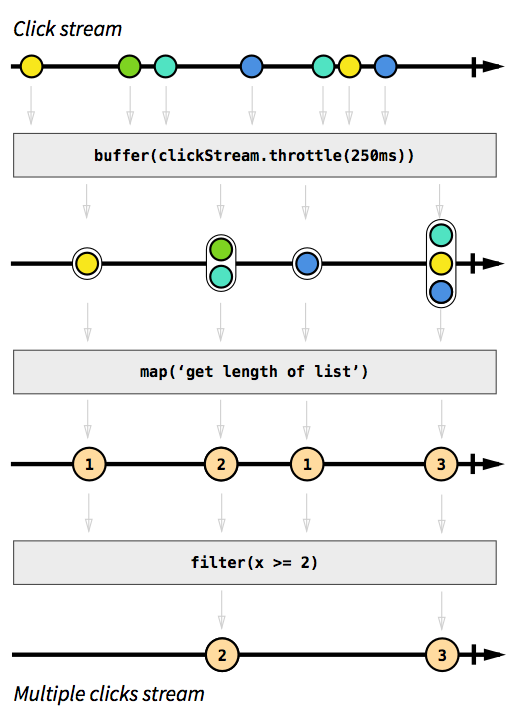
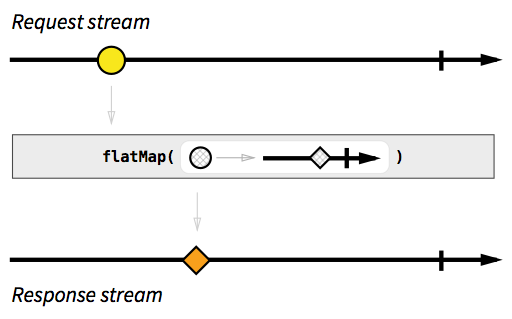

**Reactive programming** *is a* [programming paradigm](https://en.wikipedia.org/wiki/Programming_paradigm) *oriented around* [data flows](https://en.wikipedia.org/wiki/Dataflow_programming) *and the propagation of change. This means that it should be possible to express static or dynamic data flows with ease in the programming languages used, and that the underlying execution model will automatically propagate changes through the data flow*.

In the short description:

**Reactive programming is programming with asynchronous data streams.**
So what is the stream ?


We can imagine data streams like below image.


source: atom.io

A stream is a sequence of ongoing events ordered in time. When using stream, we need focus on 3 items:
- Data
- Error
- The time when task completed.

With synchronous, it's easy to determine these items but with asynchronous it's quite difficult.

**Function Reactive Programming**  has solved the problem for using a stream to transfer data and it can emit three different things : a value (of some type), an error, or a "completed" signal.


We capture these emitted events only **asynchronously**, by defining a function that will execute when a value is emitted, another function when an error is emitted, and another function when 'completed' is emitted. Sometimes these last two can be omitted and you can just focus on defining the function for values. The "listening" to the stream is called **subscribing**. The functions we are defining are observers. The stream is the subject (or "observable") being observed. This is precisely the [Observer Design Pattern](https://en.wikipedia.org/wiki/Observer_pattern).

An alternative way of drawing that diagram is with ASCII, which we will use in some parts of this tutorial:

```
--a---b-c---d---X---|->

a, b, c, d are emitted values
X is an error
| is the 'completed' signal
---> is the timeline
```

### Why should I consider adopting RP? ###

**Advantages**

- Providing tools for handling stream data allow filter (scan, take) or convert stream to another stream (map, flatMap, reduce) or merge many stream to one stream (combine, merge, zip...)  easy that not change status of original stream.
  

  
- Loose coupling of components
- Coordinating concurrent asynchronous tasks
- Thread safety
- Improves user experience: The asynchronous nature of FRP means that whatever you program with it will offer a smoother, more responsive product for your users to interact with. 
- Error handling in asynchronous become more easier. It separate logic and errors. 

**Disadvantages**
- Increased level of difficulty in reading and writing code. It is also complicated to write unit tests for such asynchronous code. Debugging the code is even more difficult.
- Memory leak - when working in this way, it can be easy to handle subscriptions within an app or site incorrectly. This can lead to memory leakage which could end up seriously slowing things down for users.

### When apply Reactive Programming ###

Going reactive provides an elegant solution when it comes to specific types of **high-load** or **multi-user applications**:
- *Social networks, chats*
- Games
- Audio and video apps

And to the following components of **any application type**:

- *Server code that serves highly interactive UI elements*
- *Proxy servers, load balancers*
- *Artificial intelligence, machine learning*
- *Real-time data streaming*

Reference:

- https://gist.github.com/staltz/868e7e9bc2a7b8c1f754#thinking-in-rp-with-examples
- https://developers.redhat.com/blog/2017/06/30/5-things-to-know-about-reactive-programming/
- https://www.scnsoft.com/blog/java-reactive-programming